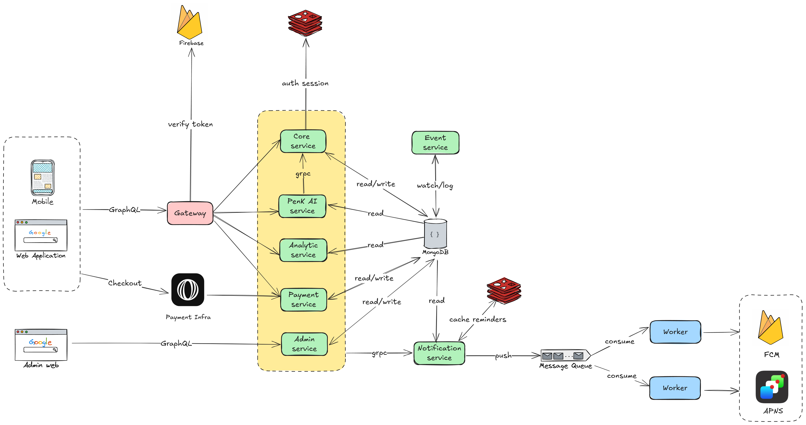

<h1 align="center"> <span>PenK Backend</span></h1>

<p align="center">A monorepo of microservices-based backend system for PenK Assistant.</p>



## Table of Contents
- [Prerequisites](#prerequisites)
- [Getting Started](#getting-started)
- [Database Management](#database-management)
- [Running Microservices](#running-microservices)
- [Linters](#linters)
- [Docker](#docker)

## Prerequisites

### Dev Tools
- [Air](https://github.com/cosmtrek/air) - For live reload
- [Make](https://www.gnu.org/software/make/) - For running commands
- [MongoDB Database Tools](https://www.mongodb.com/docs/database-tools/installation) - For database operations
- [Protocol Buffer Compiler](https://grpc.io/docs/protoc-installation/) - For compiling Protocol Buffer files
- [Go Protocol Buffer Plugin](https://grpc.io/docs/languages/go/quickstart/#prerequisites) - For generating Go code from Protocol Buffers
- [golangci-lint](https://golangci-lint.run/welcome/install/) - For Go code linting
- [protolint](https://github.com/yoheimuta/protolint) - For Protocol Buffer linting

### VSCode Setup
1. Install the `Go` extension
2. Install `gofumpt`:
   ```sh
   go install mvdan.cc/gofumpt@latest
   ```
3. Configure VSCode settings (Ctrl/Cmd + Shift + P → "Preferences: Open User Settings (JSON)"):
   ```json
   {
     "go.useLanguageServer": true,
     "gopls": {
       "formatting.gofumpt": true
     }
   }
   ```


### Install dependencies
```sh
# Install golang dependencies of all modules 
make tidy

# Install node modules
cd services/gateway
npm install
```

## Getting Started

1. Create `.env.development` file at the root level of the project
2. Copy `.env.example` to `.env.development` and fill in secrets
3. Prepare some credential files of Firebase and OpenAI
4. Run microsevices and gateway

## Database Management

### MongoDB Migrations
Using [migrate-mongo](https://www.npmjs.com/package/migrate-mongo):

```sh
# Install migrate-mongo
npm i -g migrate-mongo

# Migration commands
migrate-mongo up
migrate-mongo down
migrate-mongo status
```

### MongoDB Tools
```sh
# Backup entire database
make dump

# Restore entire database
make restore

# Restore specific collection
make restore-col COL=<collection-name>
```

## Running microservices
```sh
# Run a specific service
make core

# Run microservices (Test DB)
make test SERVICE="core analytic timetracking notification penk payment"

# Run microservices (Dev DB)
make dev SERVICE="core analytic timetracking notification penk payment"

# Run gateway 
make gateway

# Run unit tests
make unit-test

# Run API tests
make api-test
```

## Linters
```sh
# Code linting check and fix
make lint
make lint-fix

# Protocol Buffer linting check and fix
make protolint
make protolint-fix
```

## Docker

```sh
# Build and start containers
make up

# Stop containers
make down

# Stop containers and remove images
make down-rmi

# Clean up unused resources
make clean

# View container logs
make logs
```
